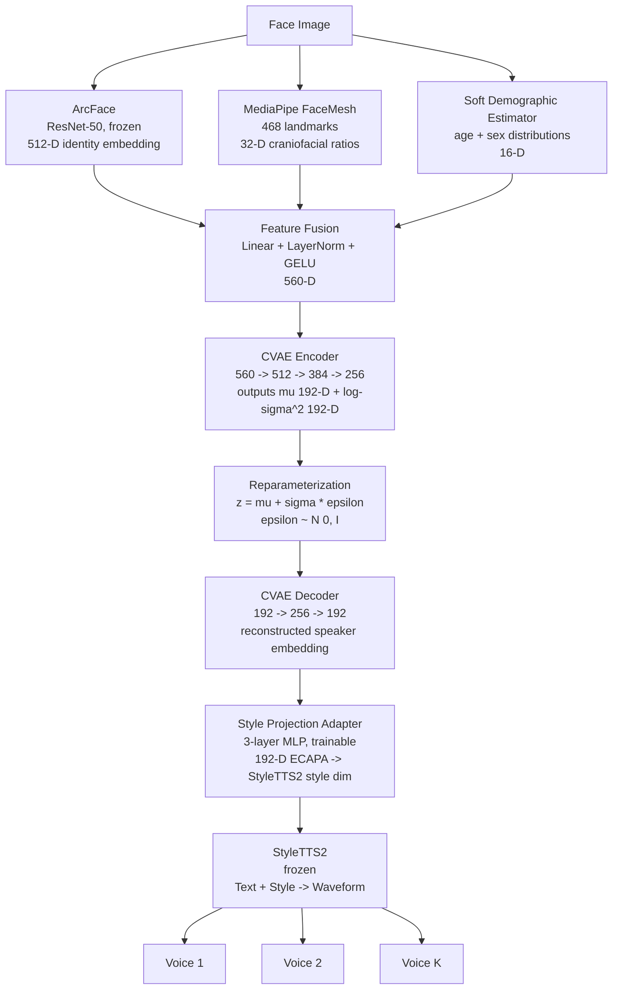
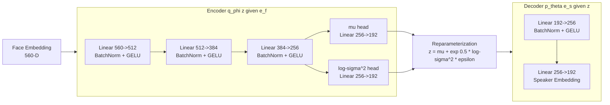
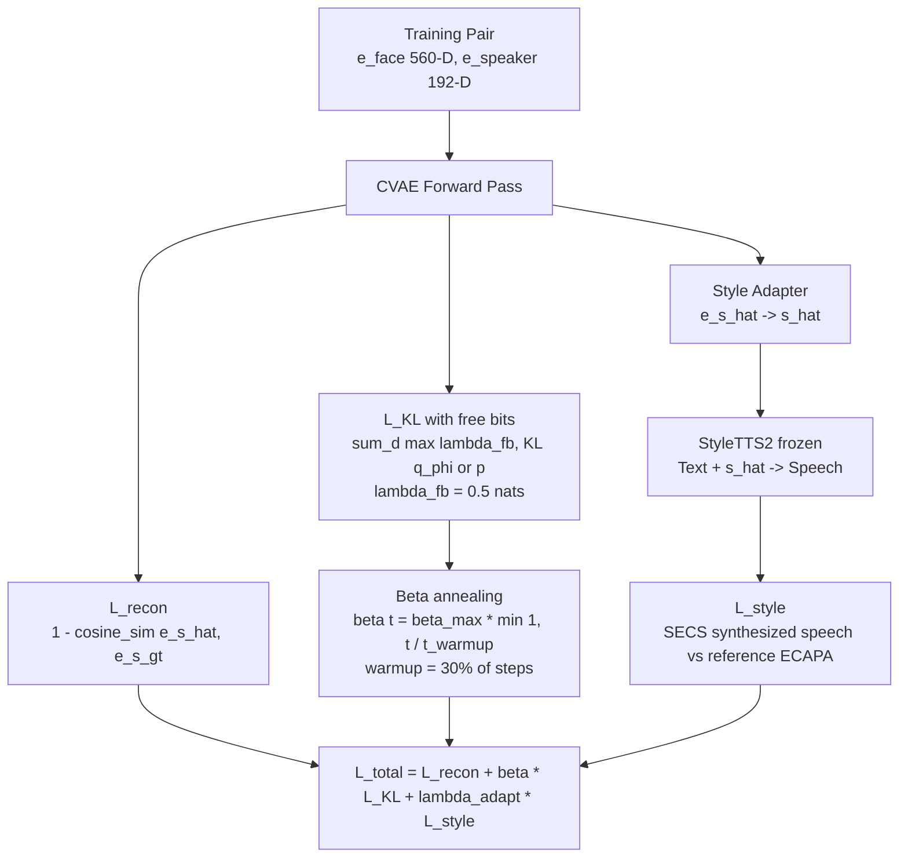
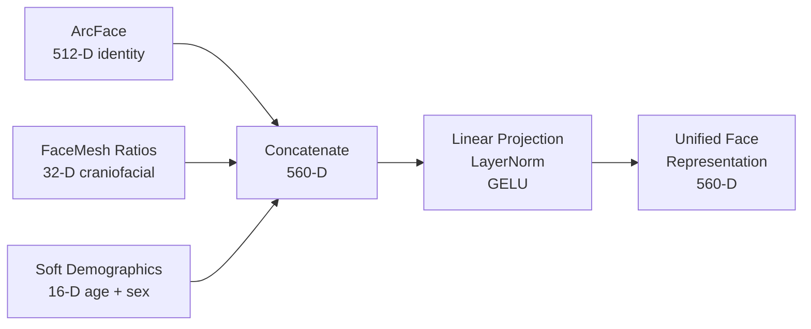
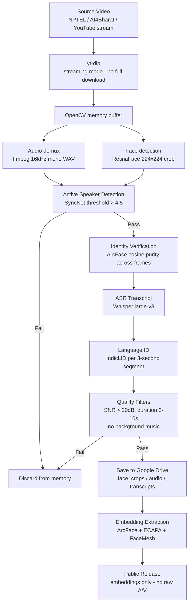

# VOIX: Probabilistic Face-to-Voice Generation Through Cross-Modal Identity Modeling

**VOIX** is a research system for probabilistic face-to-speech synthesis. Given a single face image and a text input, it generates a *distribution* over plausible speaker voices rather than a single deterministic output. The core claim is that facial appearance provides evidence about voice — not a specification of it — and the correct computational treatment is a learned conditional probability distribution, not a regression function.

The system makes three contributions: (1) a Conditional VAE mapper predicting Gaussian parameters over ECAPA-TDNN speaker embeddings conditioned on a multi-feature facial representation, (2) an India-specific face-to-speech benchmark dataset covering five Indian languages with 25% code-switching, and (3) a systematic ablation establishing which facial features actually contribute predictive information about voice.

---

## Table of Contents

- [Motivation](#motivation)
- [Problem Formulation](#problem-formulation)
- [System Architecture](#system-architecture)
- [Datasets](#datasets)
- [Evaluation](#evaluation)
- [Repository Structure](#repository-structure)
- [Documentation](#documentation)
- [Literature Survey](#literature-survey)
- [Infrastructure](#infrastructure)
- [Publication Target](#publication-target)

---

## Motivation

Every prior face-to-voice system treats the mapping as a deterministic function:

```
f : Face Image  ->  Single Speaker Embedding  ->  Single Voice
```

This formulation is computationally convenient but scientifically incorrect. The human voice is determined by two fundamentally different categories of factors:

| Category | Examples | Observable from Face |
|---|---|---|
| Physiological | Vocal tract length, jaw structure, laryngeal anatomy, subglottal resonance | Partially (correlated with craniofacial geometry) |
| Learned and environmental | Accent, dialect, prosody, code-switching habits, vocal fry, breathiness | Not at all |

The vocal tract length correlates with body height at r = 0.926 and with log body mass at r = 0.941 (Fitch and Giedd, JASA 1999). Jaw length correlates with fundamental frequency at r = -0.528 to -0.577 (Macari et al., Journal of Voice 2014). These are moderate correlations — not deterministic mappings. A face *constrains* the plausible voice space; it does not uniquely determine a voice.

The correct formulation is a conditional distribution:

```
P(voice | face) : Face Image  ->  Distribution over Speaker Embeddings  ->  K Plausible Voices
```

Additionally, every established face-to-voice dataset (VoxCeleb1/2, LRS3, AVSpeech) is Western-centric and contains no representation of Indian linguistic diversity — a population of 1.4 billion speakers with markedly different craniofacial morphology distributions, retroflex phoneme patterns, tonal prosody structures, and endemic code-switching between Indian languages and English.

---

## Problem Formulation

Given a face image **I** and optional text **T**, learn a generative model:

```
P(e_s | e_f)  :  Speaker Embedding Distribution conditioned on Face Embedding
```

Where:
- `e_f` in R^560 — fused face representation: ArcFace identity (512-D) + FaceMesh craniofacial ratios (32-D) + soft demographic indicators (16-D)
- `e_s` in R^192 — speaker embedding in ECAPA-TDNN space
- `P(e_s | e_f) = N(mu_theta(e_f), sigma_theta^2(e_f))` — predicted Gaussian over speaker embedding space

At inference, K plausible voices are sampled:

```
z_k ~ N(mu_theta(e_f), sigma_theta^2(e_f)),   k = 1,...,K
Speech_k = StyleTTS2(text=T, style=P_adapter(z_k))
```

### Research Questions

**RQ1 (Probabilistic Modeling):** Can a CVAE-based mapper learn a meaningful distribution over speaker embeddings conditioned on facial appearance, such that sampled voices are both perceptually plausible and mutually diverse?

**RQ2 (Feature Contribution):** Does incorporating craniofacial morphological features from MediaPipe FaceMesh alongside ArcFace identity embeddings improve face-to-voice prediction over identity embeddings alone?

**RQ3 (Demographic Generalization):** Do F2V models trained on Western data exhibit measurable performance degradation on Indian faces and voices, and does fine-tuning on an India-specific benchmark recover this gap?

---

## System Architecture

### End-to-End Pipeline



### CVAE Probabilistic Mapper



### Training Loss Structure



### Feature Fusion Detail



### Indian Benchmark Data Collection Pipeline



---

## Datasets

### Training: VoxCeleb2

| Attribute | Value |
|---|---|
| Identities | 6,112 speakers |
| Utterances | 1.1 million clips |
| Duration | 2,442 hours |
| Training subset | 2,000 speakers x 50 utterances = 100K pairs |
| Usage | ArcFace + ECAPA + FaceMesh extraction; CVAE adapter training |

### In-Domain Evaluation: VoxCeleb1

| Attribute | Value |
|---|---|
| Identities | 1,251 speakers |
| Utterances | 153,000 clips |
| Usage | Recall@K, SECS, speaker generalization |

### Out-of-Domain Evaluation: India F2S Benchmark (Contribution)

| Attribute | Target |
|---|---|
| Duration | 20 hours |
| Speakers | 40-60 |
| Languages | Hindi, Tamil, Telugu, Bengali, Marathi |
| Code-switching proportion | 25% of clips |
| Gender ratio | 50:50 |
| Primary sources | NPTEL (CC-licensed), AI4Bharat, IndicTTS |
| Public release format | Embeddings only (ArcFace + ECAPA + metadata) via HuggingFace Datasets |

---

## Evaluation

### Objective Metrics

| Metric | Formula | Measures |
|---|---|---|
| SECS | Mean cosine_sim(ECAPA(Speech_k), e_s_gt) over K=3 | Speaker identity similarity |
| Recall@K | Fraction correct retrievals at K from N-candidate pool | Identity retrieval accuracy |
| Diversity Score (DS) | Mean pairwise cosine distance between K sampled embeddings | Voice diversity from single face |
| ECE | Sum of |P_predicted - P_actual| coverage calibration | Uncertainty calibration quality |
| FSD | Frechet distance between predicted and real embedding distributions | Distribution-level quality |

Diversity Score is reported jointly with SECS. High DS with low SECS indicates diverse but incorrect voice generation.

### Subjective Metrics

| Metric | Scale | Protocol |
|---|---|---|
| MOS naturalness | 1-5 (ITU-T P.808) | 20-25 evaluators via Prolific |
| Face-voice consistency MOS | 1-5 | Same evaluator pool, independent rating |
| A/B preference test | Win / Loss / Tie % | VOIX vs. deterministic baseline B3 |
| Diversity preference test | % natural vs. random | 3 voices from same face |

### Ablation Studies

**Feature ablation (RQ2):**

| Experiment | Input | Dimensions |
|---|---|---|
| A1 | ArcFace only | 512-D |
| A2 | FaceMesh only | 32-D |
| A3 | Demographics only | 16-D |
| A4 | ArcFace + FaceMesh | 544-D |
| A5 | ArcFace + Demographics | 528-D |
| A6 | Full (all features) | 560-D |

SHAP feature attribution is computed on the best model to identify which craniofacial ratio dimensions carry predictive signal.

**Architecture ablation:**

| Experiment | Modification |
|---|---|
| B1 | beta = 0 throughout (deterministic) |
| B2 | KL without free bits |
| B3 | KL without beta annealing |
| B4 | Full CVAE (proposed) |

### Baselines

| ID | Description | Purpose |
|---|---|---|
| B1 | Random ECAPA embedding | Lower bound |
| B2 | Nearest-neighbor face retrieval | Non-generative strong baseline |
| B3 | Deterministic mapper (beta=0) | Tests value of probabilistic component |
| B4 | ArcFace-only CVAE | Feature ablation reference |
| B5 | Zero-Shot F2S (arXiv 2026) | Closest prior work |
| B6 | GMM-style implicit generation | Implicit probabilistic comparison |

---

## Repository Structure

```
Voix-F2S-System/
|
|-- project-context/           # Project documentation
|   |-- context.md             # Problem definition, research questions, objectives
|   |-- architecture.md        # Full system design, modules, design decisions
|   |-- research.md            # Literature survey in engineering-useful form
|   |-- mvp.md                 # Scope, phased deliverables, validation gates
|   |-- tasks.md               # Week-by-week implementation checklist
|
|-- Initial Docs/              # Pre-implementation reference documents
|   |-- voix_master_document.md
|   |-- voix_lit_survey_outline.md
|   |-- Voix F2S lit survey.csv
|   |-- Voix F2S lit survey.pdf
|
|-- Papers/                    # All 25 surveyed papers as PDF
|
|-- README.md
|-- .gitignore
```

Implementation directories (to be created):
```
|-- data/                      # Extraction and dataset pipeline scripts
|-- models/                    # CVAE mapper, fusion layer, adapter definitions
|-- training/                  # Training loop, loss functions, schedulers
|-- evaluation/                # SECS, Recall@K, DS, ECE, FSD computation
|-- scripts/                   # Extraction, preprocessing, inference scripts
```

---

## Documentation

| Document | Purpose |
|---|---|
| [context.md](project-context/context.md) | What VOIX is, why it exists, hypotheses, success criteria |
| [architecture.md](project-context/architecture.md) | Full system design — every module, interface, and design decision |
| [research.md](project-context/research.md) | 25-paper literature survey distilled into implementation decisions |
| [mvp.md](project-context/mvp.md) | Scope boundaries, phased deliverables, fallback positions |
| [tasks.md](project-context/tasks.md) | Week-by-week implementation checklist |

Reading order for new contributors: `context.md` -> `architecture.md` -> `research.md` -> `mvp.md` -> `tasks.md`

---

## Literature Survey

The repository includes a 25-paper survey organized across six research buckets, each mapped to a system module:

| Bucket | Domain | Papers | Key Works |
|---|---|---|---|
| 1 | Cross-modal biometric matching and synthesis | 1-4 | Speech2Face, Seeing Voices, ImageBind, Imaginary Voice |
| 2 | Visual biometrics and 3D craniofacial geometry | 5-8 | ArcFace, FLAME, DECA, EMOCA |
| 3 | Speaker embeddings, neural codecs, zero-shot TTS | 9-12 | ECAPA-TDNN, DAC, StyleTTS 2, NaturalSpeech 3 |
| 4 | Probabilistic generative modeling | 13-16 | CVAE, beta-VAE, Flow Matching, Latent Diffusion |
| 5 | Craniofacial biomechanics and vocal tract physics | 17-19 | Fitch and Giedd 1999, Macari et al. 2014, Li et al. ACM MM 2023 |
| 6 | Audiovisual corpora, fairness, and audio forensics | 20-25 | Learnable PINs, VoxCeleb2, AVSpeech, Fenu and Marras 2022, SVARAH, AudioSeal |

Full survey: [Initial Docs/voix_lit_survey_outline.md](Initial%20Docs/voix_lit_survey_outline.md)
Detailed matrix: [Initial Docs/Voix F2S lit survey.csv](Initial%20Docs/Voix%20F2S%20lit%20survey.csv)

---

## Infrastructure

| Component | Specification |
|---|---|
| Deep Learning | PyTorch 2.x |
| Face Detection | RetinaFace (pytorch) |
| Face Embedding | ArcFace via InsightFace |
| Landmark Extraction | MediaPipe 0.10.x |
| Speaker Embedding | ECAPA-TDNN via SpeechBrain |
| Speech Synthesis | StyleTTS2 (frozen) |
| Active Speaker Detection | SyncNet (VGG implementation) |
| ASR | OpenAI Whisper large-v3 |
| Language Identification | IndicLID (AI4Bharat) |
| Experiment Tracking | Weights and Biases (free tier) |
| Model Hosting | HuggingFace Hub |
| Primary GPU | RTX 4050 (6GB VRAM) |
| Backup GPU | Google Colab T4 (15GB VRAM) |

---

## Reproducibility

All results are reported as mean +/- standard deviation over 3 independent seeds (torch.manual_seed(42) base, +1, +2). All hyperparameters are logged to Weights and Biases run configs and exported to JSON. Model checkpoints will be released on HuggingFace Hub. The India F2S benchmark will be released as an embedding-only package (ArcFace + ECAPA embeddings + metadata.csv) via HuggingFace Datasets. Raw audio and video will not be redistributed. VoxCeleb2 embedding extraction scripts will be released in place of the derived embeddings.

---

## Ethical Statement

All synthesized audio generated by VOIX is watermarked using AudioSeal (San Roman et al., 2024) — a proactive localized neural watermarking system achieving AUC 0.97 and sample-level IoU 0.99, operating at 485x the detection speed of prior methods. Every VOIX output is verifiably attributable as AI-generated.

Soft demographic indicators (age, sex) are used as probability distributions conditioning the generative prior, not as hard demographic classifiers. The India F2S benchmark includes only public figures and NPTEL/AI4Bharat-licensed content. Explicit data ethics declarations will accompany the paper submission per venue requirements.

---

## Publication Target

**Primary target:** INTERSPEECH (next available deadline post 16-week implementation window)
**Alternative targets:** ICASSP (model contribution), NeurIPS Datasets and Benchmarks track (if Indian benchmark is the primary contribution)

---

## Status

Pre-implementation. Literature survey complete. System design finalized. Implementation begins Week 1.

---

*Solo researcher project. Contact via GitHub Issues.*
