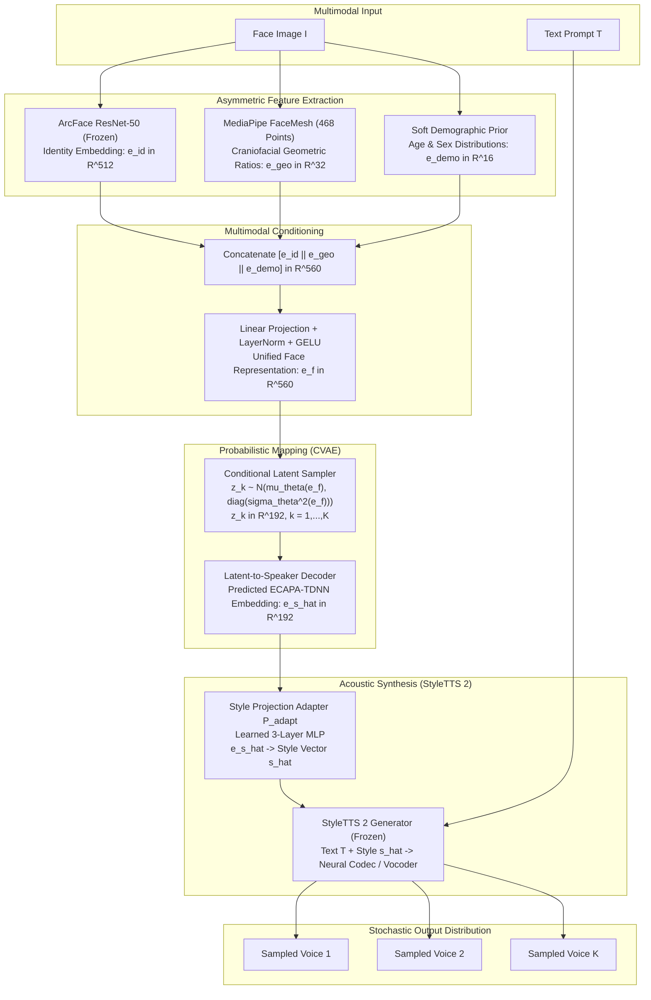
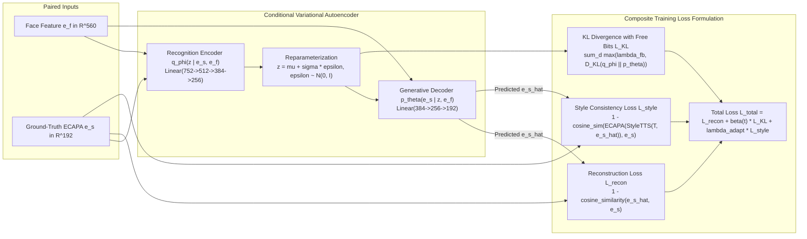
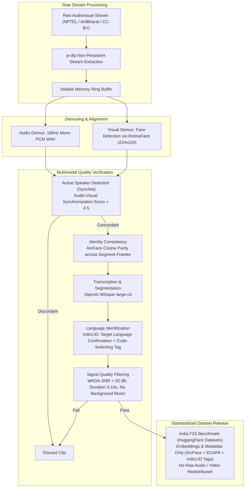

# VOIX: Probabilistic Face-to-Voice Generation Through Cross-Modal Identity Modeling

<p align="center">
  
</p>

**VOIX** is a research system for probabilistic face-to-speech synthesis. Given a single face image and a text input, it generates a *distribution* over plausible speaker voices rather than a single deterministic output. The core hypothesis is that facial appearance provides evidence about voice—not an exact specification—and the correct computational formulation is a learned conditional probability distribution, not a deterministic regression.

The system makes three contributions: (1) a Conditional VAE mapper predicting Gaussian parameters over ECAPA-TDNN speaker embeddings conditioned on an asymmetric multi-feature facial representation, (2) an India-specific face-to-speech benchmark dataset covering five Indian languages with 25% code-switching, and (3) a systematic ablation establishing the empirical predictive contribution of craniofacial morphology versus biometric identity.

---

## Table of Contents

- [Motivation](#motivation)
- [Problem Formulation](#problem-formulation)
- [System Architecture](#system-architecture)
- [Datasets](#datasets)
- [Evaluation](#evaluation)
- [Repository Structure](#repository-structure)
- [Documentation](#documentation)
- [Infrastructure](#infrastructure)
- [Reproducibility](#reproducibility)
- [Ethical Statement](#ethical-statement)

---

## Motivation

Existing face-to-voice architectures formulate synthesis as a deterministic mapping:

```
f : Face Image  ->  Single Speaker Embedding  ->  Single Voice
```

This formulation is computationally convenient but physically ill-posed. The human voice is determined by two fundamentally distinct categories of factors:

| Category | Examples | Observable from Face |
|---|---|---|
| Physiological | Vocal tract length, jaw structure, laryngeal anatomy, subglottal resonance | Partially (correlated with craniofacial geometry) |
| Learned and environmental | Accent, dialect, prosody, code-switching habits, vocal fry, breathiness | Not at all |

Craniofacial allometry partially constrains acoustic resonance: vocal tract length correlates with body height at r = 0.926 and log body mass at r = 0.941 (Fitch and Giedd, JASA 1999). Mandibular dimensions correlate with fundamental frequency at r = -0.528 to -0.577 (Macari et al., Journal of Voice 2014). These anatomical relationships establish statistical boundaries on the voice space rather than an injective mapping. A face *constrains* the plausible voice space; it cannot uniquely determine a voice.

Consequently, VOIX models face-to-voice generation as an explicit conditional probability distribution:

```
P(voice | face) : Face Image  ->  Distribution over Speaker Embeddings  ->  K Plausible Voices
```

Furthermore, standard audio-visual corpora (VoxCeleb, LRS3, AVSpeech) are culturally and phonetically Western-centric. They fail to represent Indian linguistic diversity, where 1.4 billion speakers exhibit distinct craniofacial morphology distributions, retroflex phonological structures, and endemic code-switching between regional languages and English.

---

## Problem Formulation

Given a face image **I** and a text prompt **T**, the objective is to learn a conditional generative model:

```
P(e_s | e_f)  :  Distribution over Speaker Embeddings conditioned on Face Representation
```

Where:
- `e_f` in R^560 is a fused face representation: ArcFace identity (512-D) + MediaPipe FaceMesh craniofacial ratios (32-D) + soft demographic priors (16-D).
- `e_s` in R^192 is the target speaker embedding residing in ECAPA-TDNN acoustic space.
- `P(e_s | e_f) = N(mu_theta(e_f), diag(sigma_theta^2(e_f)))` is the predicted Gaussian distribution over speaker embeddings.

During inference, K candidate voice styles are sampled from the posterior predictive distribution:

```
z_k ~ N(mu_theta(e_f), diag(sigma_theta^2(e_f))),   k = 1, ..., K
Speech_k = StyleTTS2(text=T, style=P_adapt(z_k))
```

### Research Questions

- **RQ1 (Probabilistic Modeling):** Can a CVAE-based mapper learn a well-calibrated distribution over speaker embeddings conditioned on facial appearance such that sampled voices are simultaneously perceptually natural, identity-consistent, and mutually diverse?
- **RQ2 (Feature Disentanglement):** Does augmenting facial identity embeddings (ArcFace) with explicit craniofacial geometric ratios (FaceMesh) yield statistically significant improvements in voice prediction accuracy over identity representations alone?
- **RQ3 (Demographic Generalization):** What is the empirical performance degradation of Western-trained F2V models when evaluated on Indian speakers, and does domain adaptation on an India-specific benchmark close this cross-modal distribution gap?

---

## System Architecture

The architecture consists of three core components: an asymmetric feature extraction and fusion pipeline, a conditional variational latent mapper, and a zero-shot acoustic generator.

### 1. End-to-End Inference Pipeline



### 2. CVAE Architecture and Composite Training Objective



### 3. Multimodal Benchmark Data Curation Pipeline



---

## Datasets

### Training: VoxCeleb2

| Attribute | Specification |
|---|---|
| Identities | 6,112 speakers |
| Utterances | 1.1 million clips (2,442 hours) |
| Curated Training Subset | 2,000 speakers x 50 utterances = 100,000 paired samples |
| Representation | Pre-extracted offline: ArcFace (512-D), ECAPA-TDNN (192-D), FaceMesh ratios (32-D) |

### In-Domain Evaluation: VoxCeleb1

| Attribute | Specification |
|---|---|
| Identities | 1,251 speakers |
| Utterances | 153,000 clips |
| Evaluation Protocol | Closed-set identification (Recall@K), speaker embedding cosine similarity (SECS) |

### Out-of-Domain Evaluation: India F2S Benchmark

| Attribute | Specification |
|---|---|
| Target Duration | 20 hours (40-60 verified identities) |
| Languages | Hindi, Tamil, Telugu, Bengali, Marathi |
| Phonetic Diversity | 25% verified code-switched utterances (Indic-English) |
| Gender Balance | 50:50 verified demographic split |
| Primary Sources | NPTEL (CC-BY licensed), AI4Bharat, IndicTTS public archives |
| Distribution Format | Embedding features and metadata manifest only via HuggingFace Datasets |

---

## Evaluation

### Objective Metrics

| Metric | Formulation | Measured Property |
|---|---|---|
| SECS | Mean cosine similarity between ECAPA(Speech_k) and ground-truth e_s over K=3 | Acoustic identity preservation |
| Recall@K | Fraction of correct ground-truth identity retrievals within top-K candidates | Cross-modal retrieval precision |
| Diversity Score (DS) | Mean pairwise cosine distance between K sampled latent embeddings | Inter-sample variance from identical face conditioning |
| ECE | Expected Calibration Error over empirical predictive confidence intervals | Posterior uncertainty calibration |
| FSD | Frechet Speaker Distance between predicted and empirical ECAPA distributions | Global distribution-level fidelity |

Diversity Score is evaluated jointly with SECS. High DS with low SECS indicates degenerate random generation rather than calibrated multimodal ambiguity.

### Subjective Evaluation

| Metric | Scale / Methodology | Evaluator Pool |
|---|---|---|
| MOS Naturalness | 1-5 scale (ITU-T P.808 standard) | 20-25 independent evaluators |
| Face-Voice Consistency MOS | 1-5 scale (Perceived physiological congruence) | Matched evaluator pool, randomized pairs |
| A/B Preference Test | Pairwise Forced Choice (% Preference vs. Deterministic Baseline) | Blinded comparative evaluation |

### Ablation Matrix

**Feature Ablation (RQ2):**

| ID | Input Feature Set | Dimension | Target Hypothesis |
|---|---|---|---|
| A1 | ArcFace identity only | 512-D | Baseline biometrics |
| A2 | FaceMesh geometry only | 32-D | Pure morphological signal |
| A3 | Soft demographics only | 16-D | Demographic prior baseline |
| A4 | ArcFace + FaceMesh | 544-D | Combined identity and morphology |
| A5 | ArcFace + Demographics | 528-D | Standard biometrics with demographic conditioning |
| A6 | Full Multimodal Fusion | 560-D | Complete VOIX feature space |

SHAP (SHapley Additive exPlanations) values are computed across all 32 craniofacial ratio dimensions to isolate specific facial proportions that drive fundamental frequency (F0) and formant structure predictions.

**Architecture Ablation:**

| ID | Configuration | Purpose |
|---|---|---|
| B1 | beta = 0 (Deterministic MLP regression) | Validates necessity of probabilistic modeling |
| B2 | Standard CVAE (No free-bits threshold) | Quantifies impact of posterior collapse |
| B3 | CVAE without beta annealing schedule | Measures optimization stability |
| B4 | Full CVAE (Free bits + Cyclical beta annealing) | Proposed architecture |

### Comparative Baselines

- **B1 (Uniform Random):** Random speaker embedding sampled from empirical unit sphere (empirical lower bound).
- **B2 (Nearest-Neighbor Retrieval):** Direct cosine retrieval of closest face embedding in training corpus.
- **B3 (Deterministic Regression):** MLP mapping face features directly to point estimate e_s.
- **B4 (ArcFace-Only CVAE):** Standard identity-conditioned variational autoencoder without geometric features.
- **B5 (Zero-Shot F2S):** Direct reproduction of state-of-the-art deterministic cross-modal baseline.

---

## Repository Structure

```
Voix-F2S-System/
|
|-- project-context/           # Canonical engineering and scientific specifications
|   |-- context.md             # Theoretical foundation, formal problem definition, hypotheses
|   |-- architecture.md        # Mathematical formulation, layer-by-layer specs, interface contracts
|   |-- research.md            # Literature synthesis mapped to implementation decisions
|   |-- mvp.md                 # Scope boundaries, phased deliverables, contingency plans
|   |-- tasks.md               # Phased implementation schedule and milestone checklists
|
|-- Initial Docs/              # Pre-implementation reference documents and exploratory notes
|   |-- voix_master_document.md
|   |-- voix_lit_survey_outline.md
|   |-- Voix F2S lit survey.csv
|   |-- Voix F2S lit survey.pdf
|
|-- Papers/                    # Archive of surveyed literature
|
|-- README.md
|-- .gitignore
```

Core source code modules to be populated across implementation phases:
```
|-- data/                      # Stream extraction, filtering, and embedding pipelines
|-- models/                    # CVAE mapper, fusion layers, and StyleTTS adapter networks
|-- training/                  # Optimization loops, loss modules, and learning rate schedulers
|-- evaluation/                # Evaluation suite: SECS, Recall@K, DS, ECE, and FSD
|-- scripts/                   # Batch extraction, preprocessing, and inference routines
```

---

## Documentation

Comprehensive project documentation is maintained under [`project-context/`](project-context/):

| Document | Purpose |
|---|---|
| [`context.md`](project-context/context.md) | Theoretical background, research questions, formal hypotheses, and project boundaries |
| [`architecture.md`](project-context/architecture.md) | Component contracts, neural network dimensions, tensor shapes, and loss formulations |
| [`research.md`](project-context/research.md) | Synthesis of 25 literature foundations translated into concrete architectural choices |
| [`mvp.md`](project-context/mvp.md) | Target deliverables, validation gates, compute constraints, and fallback plans |
| [`tasks.md`](project-context/tasks.md) | Phased work packages, tracking checklists, and milestone gates |

---

## Infrastructure

| Component | Specification |
|---|---|
| Core Framework | PyTorch 2.x |
| Face Detection | RetinaFace (PyTorch implementation) |
| Identity Encoding | ArcFace (InsightFace ResNet-50) |
| Craniofacial Landmark Tracking | MediaPipe 0.10.x |
| Acoustic Speaker Encoding | ECAPA-TDNN (SpeechBrain) |
| Acoustic Speech Synthesis | StyleTTS 2 (Frozen pretrained checkpoint) |
| Active Speaker Synchronization | SyncNet (VGG Audio-Visual architecture) |
| Automated Speech Recognition | OpenAI Whisper large-v3 |
| Language Identification | IndicLID (AI4Bharat) |
| Experiment Tracking | Weights and Biases |
| Primary Compute Environment | NVIDIA RTX 4050 GPU (6 GB VRAM) |
| Auxiliary Compute Environment | Google Colab NVIDIA T4 GPU (15 GB VRAM) |

---

## Reproducibility

All experiments are conducted across three fixed random seeds (`torch.manual_seed(42)`, `43`, `44`). Model checkpoints, training configurations, and loss trajectories are logged to Weights and Biases and preserved as JSON manifests. Model weights will be made available via the HuggingFace Hub. The India F2S benchmark will be published as pre-computed embedding vectors and metadata manifests via HuggingFace Datasets; raw media streams are not redistributed.

---

## Ethical Statement

All speech synthesized by VOIX is cryptographically attributed using AudioSeal (San Roman et al., 2024), a proactive localized neural watermarking framework achieving an AUC of 0.97 and sample-level IoU of 0.99 with negligible perceptual distortion. Every generated audio waveform contains embedded, tamper-evident provenance metadata verifying synthetic generation.

Soft demographic attributes are treated strictly as probabilistic conditioning vectors over acoustic space, not as discrete demographic classification labels. The India F2S benchmark curates content solely from Creative Commons and educational public archives (NPTEL, AI4Bharat) and adheres strictly to fair use and ethical data governance standards.

---

## Status

Pre-implementation. The 25-paper literature survey is complete (archived in [Initial Docs/voix_lit_survey_outline.md](Initial%20Docs/voix_lit_survey_outline.md), [Initial Docs/Voix F2S lit survey.csv](Initial%20Docs/Voix%20F2S%20lit%20survey.csv), and synthesized in [project-context/research.md](project-context/research.md)). Architecture, mathematical formulation, and data pipelines are finalized. Implementation commences Phase 1.

