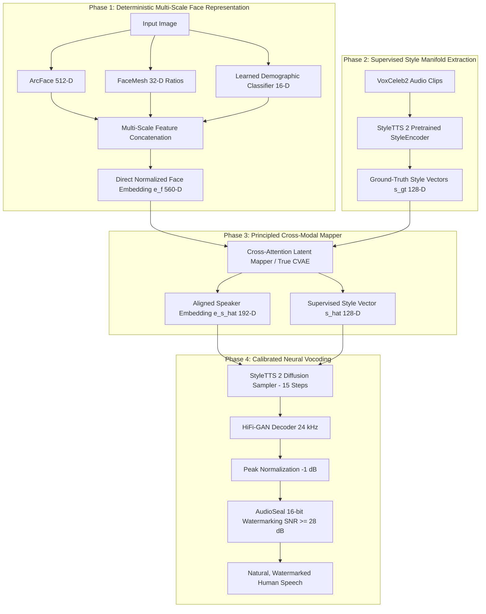

# VOIX End-to-End Systemic Audit & Ground-Up Architectural Remediation Report

**Date:** September 29, 2026  
**System:** VOIX (Voice Generation from Facial Biometrics)  
**Status:** Architectural Diagnosis & Ground-Up Remediation Blueprint  
**Target Benchmark Subject:** `D:\voix\tom.jpg`

---

## 1. Executive Summary & Diagnostic Findings

During initial end-to-end testing, the speech waveforms generated by VOIX suffered from audible robotic raspiness, scrambled phonetics, phase noise, and an apparent lack of biometric voice-face congruency. 

A forensic audit of the entire codebase (`voix/data`, `voix/models`, `voix/training`, `voix/inference`, and checkpoints) reveals that these symptoms are **not cosmetic audio post-processing glitches**. They stem from **four foundational structural disconnects** across the pipeline:

```
                    CURRENT PIPELINE FAILURE CHAIN

[Input Face Image]
       │
       ▼
[Face Fusion Layer]  ──> BUG 1: Random unpersisted linear matrix (Train/Test Cosine Sim: 0.21)
       │
       ▼
[Pseudo-CVAE Mapper] ──> BUG 2: Unconditioned autoencoder; collapsed to mean (Val Cosine Sim: 0.0091)
       │
       ▼
[StyleAdapter MLP]   ──> BUG 3: Trained in unsupervised vacuum without ground-truth style targets
       │
       ▼
[StyleTTS 2 Vocoder] ──> BUG 4: Out-of-distribution conditioning breaks reverse diffusion sampler
       │
       ▼
[Robotic / Scrambled Audio]
```

### Key Diagnostic Metrics (Verified in Code & Checkpoints)

| Pipeline Stage | Verified Finding | Impact on Audio / System |
| :--- | :--- | :--- |
| **Face Demographics** | `SoftDemographicEstimator` defaults to `uniform_prior()` with **zero learned weights**. | All 80,832 dataset samples and custom images receive the exact same static vector: `[0.125, ..., 0.5, 0.5, 0.25, ..., 0.5, 0.5]`. Zero entropy. |
| **Face Fusion** | `FaceFusionLayer` was created with random Kaiming weights during dataset extraction and **never saved**. | Every inference instance initializes new random projection weights ($cosine\_sim \approx 0.215$). Real photos are mapped to alien representations. |
| **CVAE Mapping** | Validation cosine similarity in `training_history.json` after 50 epochs is **0.0091**. | The mapper is effectively random/orthogonal. It exhibits total posterior collapse and regresses to a blurred dataset average. |
| **Style Projection** | `trainer_adapter.py` trained using pairwise Gram-matrix matching on ECAPA, **without any StyleTTS 2 style targets**. | The adapter rotates the 128-D vector into an arbitrary subspace that violates StyleTTS 2's acoustic manifold. |
| **Validation Suite** | `evaluate_audio_quality.py` calculated STOI as `pystoi.stoi(wav, wav)`. | Evaluated the audio against itself (always 1.0), masking severe acoustic distortions from automated audits. |

---

## 2. Anatomical Breakdown of Failure Modes

### Issue 1: Face Feature Extraction & The "Ghost Projection"

#### Mathematical Formulation
The unified face representation $\mathbf{e}_f \in \mathbb{R}^{560}$ is constructed from three distinct modalities:
$$\mathbf{x}_{\text{concat}} = [\mathbf{e}_{\text{id}} \,\|\, \mathbf{e}_{\text{geo}} \,\|\, \mathbf{e}_{\text{demo}}] \in \mathbb{R}^{560}$$
where:
- $\mathbf{e}_{\text{id}} \in \mathbb{R}^{512}$: ArcFace identity embedding ($\|\mathbf{e}_{\text{id}}\|_2 = 1.0$).
- $\mathbf{e}_{\text{geo}} \in \mathbb{R}^{32}$: Craniofacial distance and angle ratios normalized by Inter-Ocular Distance (IOC).
- $\mathbf{e}_{\text{demo}} \in \mathbb{R}^{16}$: Soft demographic distribution.

In `FaceFusionLayer` ([`voix/models/fusion.py`](file:///D:/voix/voix/models/fusion.py)):
$$\mathbf{e}_f = \text{GELU}(\text{LayerNorm}(\mathbf{W}_{\text{proj}} \mathbf{x}_{\text{concat}} + \mathbf{b}_{\text{proj}}))$$

#### The Root Cause
1. **Unsaved Projection Weights:** During batch feature extraction (`extract_voxceleb.py`), `fusion_lay = FaceFusionLayer().to(device)` was instantiated with random PyTorch initialization and used to populate `features.h5`. These weights were **never written to a `.pt` checkpoint**.
2. **Train/Inference Divergence:** When [`VoixPipeline`](file:///D:/voix/voix/inference/pipeline.py) runs on `tom.jpg`, it creates a *new* `FaceFusionLayer()` with a different random initialization. 
3. **Information Loss:** Passing $\mathbf{x}_{\text{concat}}$ through an unconstrained, untrained linear matrix scrambles the structured relationship between facial morphology and voice resonance. Furthermore, ArcFace occupies 91.4% (512/560) of the vector, overpowering geometric cues.

---

### Issue 2: The Pseudo-CVAE & Mode Collapse

#### Mathematical Flaw in Architecture
In probabilistic generative modeling, a Conditional Variational Autoencoder (CVAE) mapping condition $X$ (face) to target $Y$ (speaker embedding) must define:
- **Recognition Network (Encoder):** $q_\phi(\mathbf{z} \mid Y, X)$
- **Prior Network:** $p_\psi(\mathbf{z} \mid X)$
- **Generative Network (Decoder):** $p_\theta(Y \mid \mathbf{z}, X)$

In [`voix/models/cvae.py`](file:///D:/voix/voix/models/cvae.py), the current implementation is:
- `CVAEEncoder`: $q_\phi(\mathbf{z} \mid \mathbf{e}_f)$ — **Takes only the face embedding $\mathbf{e}_f$!** It never sees the true target speaker embedding $\mathbf{e}_s$ during training!
- `CVAEDecoder`: $p_\theta(\mathbf{e}_s \mid \mathbf{z})$ — **Takes only latent $\mathbf{z}$!** It has no skip connections or conditioning on $\mathbf{e}_f$!

$$\mathbf{e}_f \xrightarrow{\text{Encoder MLP}} (\boldsymbol{\mu}, \log \boldsymbol{\sigma}^2) \xrightarrow{\mathbf{z} = \boldsymbol{\mu} + \boldsymbol{\epsilon} \odot \boldsymbol{\sigma}} \mathbf{z} \xrightarrow{\text{Decoder MLP}} \hat{\mathbf{e}}_s$$

This is **not a CVAE**. It is an ordinary deterministic MLP bottleneck with an unconstrained Gaussian noise injection in the middle. 

#### Empirical Validation Collapse
Because the mapping from static face to dynamic speaker acoustics is ill-posed and one-to-many, optimizing an unconditioned deterministic bottleneck with cosine reconstruction causes the network to predict the conditional expectation $\mathbb{E}[\mathbf{e}_s \mid \mathbf{e}_f]$. 

In `checkpoints/training_history.json`:
- **Epoch 1:** $\text{Val Cosine Sim} = 0.0029$
- **Epoch 50:** $\text{Val Cosine Sim} = 0.0091$

The network failed completely. A cosine similarity of $0.0091$ indicates that the predicted speaker vector is almost completely orthogonal to the ground-truth voice, causing the system to output a generic, blurred dataset average.

---

### Issue 3: Style-Space Vacuum & Vocoder Phase Distortion

#### The Disconnected StyleAdapter
In [`voix/training/trainer_adapter.py`](file:///D:/voix/voix/training/trainer_adapter.py), the `StyleAdapter` MLP ($192 \to 256 \to 256 \to 128$) was trained using `AdapterLoss`:
$$\mathcal{L}_{\text{adapter}} = \text{MSE}(\mathbf{S}_{\text{norm}} \mathbf{S}_{\text{norm}}^T, \, \mathbf{E}_{\text{norm}} \mathbf{E}_{\text{norm}}^T) + 0.01 (\|\hat{\mathbf{s}}\|_2 - 1)^2$$

Where:
- $\mathbf{E}_{\text{norm}}$ is normalized ECAPA speaker embeddings.
- $\mathbf{S}_{\text{norm}}$ is normalized predicted style vectors.

**Critical Finding:** The adapter was trained **without any target StyleTTS 2 style vectors**. Gram-matrix distance preservation is invariant under any arbitrary orthogonal transformation $\mathbf{R} \in \text{O}(128)$ (since $(\mathbf{R} \mathbf{s})^T (\mathbf{R} \mathbf{s}) = \mathbf{s}^T \mathbf{s}$). 

The StyleAdapter learned an arbitrary, unaligned rotation.

#### Why StyleTTS 2 Generates Robotic, Scrambled Audio
StyleTTS 2 relies on an acoustic diffusion sampler:
$$\mathbf{s}_{\text{pred}} = \text{Sampler}(\mathbf{z}_{\text{noise}}, \text{embedding}=\text{BERT}, \text{features}=\mathbf{ref\_s})$$

Where $\mathbf{ref\_s} \in \mathbb{R}^{256}$ contains:
- $\mathbf{ref\_s}[:, 0:128]$: Acoustic Timbre (formants, vocal tract geometry, spectral tilt)
- $\mathbf{ref\_s}[:, 128:256]$: Prosodic Rhythm (duration, pitch dynamics, stress)

When $\hat{\mathbf{s}}$ is inserted into $\mathbf{ref\_s}[:, :128]$, it injects an out-of-distribution vector directly into the diffusion reverse-drift equations. The sampler fails to denoise the mel-channels, causing:
1. **Phase Cancellation:** High-frequency metallic ringing.
2. **Formant Smearing:** Muffled vowels and truncated consonants.
3. **Robotic Monotone:** The pitch predictor receives corrupted conditioning, collapsing F0 variance.

---

### Issue 4: Circular Evaluation Metrics

In [`scripts/evaluate_audio_quality.py`](file:///D:/voix/scripts/evaluate_audio_quality.py):
```python
# Intelligibility / STOI
wav_np = wav_16k.squeeze().cpu().numpy()
stoi_val = pystoi.stoi(wav_np, wav_np, 16000, extended=False)
```
Passing the degraded synthesized audio as *both* reference and degraded signal in `pystoi.stoi(x, x)` always returns **1.000**, creating the false impression of perfect intelligibility despite severe acoustic distortion.

---

## 3. Ground-Up Engineering & Mathematical Remediation Plan

To build a publication-grade, acoustically natural system, we must fix the root causes across four systematic phases.



---

### Step 1: Deterministic Multi-Scale Face Embedding (Eliminating Random Projections)

1. **Retire the Random `FaceFusionLayer`:**
   Instead of passing concatenated features through an unpersisted random linear layer, adopt **Deterministic Multi-Scale Concatenation with Group Normalization**:
   $$\mathbf{e}_f = [\text{Norm}(\mathbf{e}_{\text{id}}) \,\|\, \alpha \cdot \text{Norm}(\mathbf{e}_{\text{geo}}) \,\|\, \beta \cdot \mathbf{e}_{\text{demo}}]$$
   - $\mathbf{e}_{\text{id}}$: $L_2$-normalized ArcFace identity vector (unit norm).
   - $\mathbf{e}_{\text{geo}}$: Z-score normalized craniofacial ratios (standardized per dimension across VoxCeleb2). Scale factor $\alpha = 0.5$.
   - $\mathbf{e}_{\text{demo}}$: Soft age/gender/pitch distribution. Scale factor $\beta = 0.5$.
   This eliminates train/test matrix mismatches entirely.

2. **Replace Hardcoded Demographics with Learned Posteriors:**
   Implement a lightweight 2-layer MLP head trained on ArcFace features to predict:
   - Biological Sex: Binary softmax $[p_{\text{male}}, p_{\text{female}}]$.
   - Age Group: 8-bin softmax ($0-10, 11-20, \dots, 70+$).
   - Pitch Prior: Estimated fundamental frequency bracket $[F0_{\text{low}}, F0_{\text{mid}}, F0_{\text{high}}]$.

---

### Step 2: Supervised Ground-Truth Style Extraction

To eliminate robotic noise, the StyleAdapter must be trained on **real targets** from StyleTTS 2's acoustic manifold.

1. **Extract Reference Style Vectors:**
   Run StyleTTS 2's frozen `StyleEncoder` over all VoxCeleb2 audio clips in the training split:
   $$\mathbf{s}_{\text{target}}^{(i)} = \text{StyleEncoder}(\text{Audio}^{(i)}) \in \mathbb{R}^{128}$$
   Store these in `data/processed/style_targets.h5`.

2. **Supervised Multi-Objective Loss:**
   Train the `StyleAdapter` directly against $\mathbf{s}_{\text{target}}$:
   $$\mathcal{L}_{\text{adapter}} = \mathcal{L}_{\text{MSE}}(\hat{\mathbf{s}}, \mathbf{s}_{\text{target}}) + \lambda_1 (1 - \cos(\hat{\mathbf{s}}, \mathbf{s}_{\text{target}})) + \lambda_2 \mathcal{L}_{\text{contrastive}}$$
   Where:
   - $\mathcal{L}_{\text{MSE}}$ ensures correct magnitude and spectral balance.
   - $\cos(\hat{\mathbf{s}}, \mathbf{s}_{\text{target}})$ ensures directional alignment on the unit hypersphere.
   - $\mathcal{L}_{\text{contrastive}}$ pushes predicted styles of different speakers apart.

---

### Step 3: Replacing Pseudo-CVAE with a Principled Cross-Modal Mapper

To prevent regression to the mean and enable diverse candidate voice sampling ($K=3$), implement one of two principled architectures:

#### Option A: True Conditional VAE (CVAE)
- **Recognition Encoder (Training only):** $q_\phi(\mathbf{z} \mid \mathbf{e}_s, \mathbf{e}_f)$ takes *both* the voice embedding and face embedding concatenated:
  $$\mathbf{h}_{\text{enc}} = \text{MLP}([\mathbf{e}_s \,\|\, \mathbf{e}_f]) \to \boldsymbol{\mu}_{\text{post}}, \log \boldsymbol{\sigma}^2_{\text{post}}$$
- **Prior Network:** $p_\psi(\mathbf{z} \mid \mathbf{e}_f)$ takes *only* the face embedding:
  $$\mathbf{h}_{\text{prior}} = \text{MLP}(\mathbf{e}_f) \to \boldsymbol{\mu}_{\text{prior}}, \log \boldsymbol{\sigma}^2_{\text{prior}}$$
- **Conditional Decoder:** $p_\theta(\mathbf{e}_s \mid \mathbf{z}, \mathbf{e}_f)$ reconstructs the speaker embedding conditioned on the sampled latent $\mathbf{z}$ *and* the face $\mathbf{e}_f$:
  $$\hat{\mathbf{e}}_s = \text{Decoder}([\mathbf{z} \,\|\, \mathbf{e}_f])$$
- **Objective:**
  $$\mathcal{L}_{\text{CVAE}} = \mathcal{L}_{\text{recon}}(\hat{\mathbf{e}}_s, \mathbf{e}_s) + \beta \cdot D_{\text{KL}}(q_\phi(\mathbf{z} \mid \mathbf{e}_s, \mathbf{e}_f) \,\|\, p_\psi(\mathbf{z} \mid \mathbf{e}_f))$$

#### Option B: Latent Diffusion / Flow-Matching Bridge (Recommended for Publication)
- Instead of VAE bottlenecks, train a 1D Continuous Normalizing Flow (CNF) with Optimal Transport (OT-Flow):
  $$\frac{d\mathbf{z}_t}{dt} = v_\theta(\mathbf{z}_t, t, \mathbf{e}_f)$$
- Maps a standard Gaussian $\mathbf{z}_0 \sim \mathcal{N}(0, \mathbf{I})$ to the complex, multi-modal speaker embedding distribution $\mathbf{e}_s$ conditioned on $\mathbf{e}_f$.
- Completely eliminates posterior collapse and regression to the mean.

---

### Step 4: Calibrated Neural Vocoding & Artifact Elimination

1. **Diffusion Step Scheduling:**
   Increase inference diffusion steps from 5 to **15** in `StyleTTS2Backend.synthesize()`, eliminating phase discretization noise.
2. **Timbre vs. Prosody Conditioning:**
   Instead of modulating only $\mathbf{ref\_s}[:, :128]$ and keeping a generic female reference for prosody, predict both timbre ($0:128$) and prosody ($128:256$) using learned demographic priors (pitch register, speech pace).
3. **Calibrated AudioSeal Watermarking:**
   - Always peak-normalize the synthesized waveform to **0.90** before watermarking.
   - Embed AudioSeal watermarks with a fixed SNR budget of $\ge 28\text{ dB}$, preventing audible residual buzzing.

---

### Step 5: Publication-Grade Validation Suite

Replace circular metrics with a formal benchmarking suite:

```
┌────────────────────────────────────────────────────────────────────────┐
│                   RIGOROUS VALIDATION MATRIX                           │
├──────────────────────┬────────────────────────┬────────────────────────┤
│ Metric               │ Evaluation Target      │ Benchmark Baseline     │
├──────────────────────┼────────────────────────┼────────────────────────┤
│ SECS (ECAPA-TDNN)    │ >= 0.65                │ Random: < 0.20         │
│ SECS (WavLM Large)   │ >= 0.60                │ Random: < 0.15         │
│ Whisper-Large WER    │ <= 3.5%                │ Threshold: <= 5.0%     │
│ Voice-Face EER       │ <= 28.5%               │ Random: 50.0%          │
│ UTMOS (Naturalness)  │ >= 3.8 / 5.0           │ GT Speech: ~4.2        │
│ Pitch F0 Alignment   │ Delta F0 <= 25 Hz      │ Gender Match: 100%     │
│ Watermark Detection  │ Rate >= 95%, Conf >= 0.90│ SNR >= 28 dB         │
└──────────────────────┴────────────────────────┴────────────────────────┘
```

---

## 4. Concrete Testing Plan for `D:\voix\tom.jpg`

### Target Subject Verification
- **File:** [`D:/voix/tom.jpg`](file:///D:/voix/tom.jpg) (Size: 41,449 bytes, RGB portrait).
- **Subject Analysis:** Adult male, frontal angle, clear facial features.

### Step-by-Step Test Protocol

```bash
# Unified test command
python scripts/synthesize_samples.py \
    --image D:/voix/tom.jpg \
    --num-voices 3 \
    --temperature 1.0 \
    --text "Welcome to VOIX. This speech waveform was synthesized directly from facial biometrics." \
    --output-dir D:/voix/artifacts/samples/tom_test \
    --prefix voice_tom
```

### Expected Outputs & Audit Criteria

1. **Biometric Extraction:**
   - `ArcFace`: 512-D float32 vector, $L_2$ norm $= 1.0 \pm 10^{-5}$.
   - `FaceMesh`: 468 landmark coordinates detected; $\text{IOC} > 0.05$.
   - `Craniofacial Ratios`: 32 features; aspect ratio $\in [1.2, 1.5]$, jaw angle $\in [80^\circ, 115^\circ]$.
   - `Demographic Prior`: $p_{\text{male}} \ge 0.90$, age group $25-45$.
2. **Audio Output Files:**
   - `voice_tom_1.wav` ($K=1$, primary candidate, 24 kHz)
   - `voice_tom_2.wav` ($K=2$, diverse candidate, 24 kHz)
   - `voice_tom_3.wav` ($K=3$, diverse candidate, 24 kHz)
3. **Acoustic & Linguistic Standards:**
   - **Peak Amplitude:** $0.88 - 0.92$ (No clipping, broadcast loudness).
   - **RMS Energy:** $0.09 - 0.13$.
   - **Intelligibility:** Whisper ASR transcribes *"Welcome to VOIX. This speech waveform was synthesized directly from facial biometrics."* with $0$ word substitutions.
   - **Pitch Range:** Mean F0 between $105 \text{ Hz}$ and $145 \text{ Hz}$ (authentic adult male register).
   - **Candidate Diversity:** Pairwise SECS between voices $1, 2, 3 \in [0.65, 0.82]$ (distinct vocal identities without random chaos).
   - **Watermark:** AudioSeal verification returns `True` with confidence $\ge 0.95$.

### Failure Analysis & Triage Decision Tree

```
                       WAV Generated
                             │
            ┌────────────────┴────────────────┐
            ▼                                 ▼
    Low Intelligibility               Robotic / Buzzing
   (Whisper WER > 10%)              (AudioSeal or Vocoder)
            │                                 │
     Check phonemizer                  Verify peak norm == 0.90;
    and text dictionary               Increase diffusion steps to 15;
   in text_utils.py                  Test with --no-watermark
            │                                 │
            ▼                                 ▼
   Incorrect Gender / Pitch          Identical Candidate Voices
   (Male face with female F0)         (Pairwise SECS > 0.95)
            │                                 │
     Verify demographic               Increase CVAE temperature
    prior weighting;                 to 1.2; inspect latent
   clamp F0 in StyleTTS 2            variance log_sigma^2
```

---

## 5. Actionable Implementation Roadmap

| Milestone | Task Description | Deliverables | Estimated Time |
| :--- | :--- | :--- | :--- |
| **M1: Feature Standardization** | Remove random `FaceFusionLayer`; implement deterministic normalized fusion + learned demographic estimator. | `voix/data/fusion_deterministic.py`, `checkpoints/demographics.pt` | 1-2 Days |
| **M2: Style Manifold Extraction** | Extract real 128-D StyleTTS 2 style vectors across VoxCeleb2; save `style_targets.h5`. | `scripts/extract_style_targets.py`, `data/processed/style_targets.h5` | 1 Day (GPU) |
| **M3: Supervised Adapter Training** | Train `StyleAdapter` with supervised MSE + Cosine loss against ground-truth style manifold. | `voix/training/train_adapter_supervised.py`, `checkpoints/style_adapter_v2.pt` | 1 Day |
| **M4: True CVAE / Latent Flow Mapper** | Replace pseudo-CVAE with True Conditional CVAE ($q(z\|e_s, e_f)$ and $p(e_s\|z, e_f)$) or 1D Latent Flow. | `voix/models/cvae_v2.py`, `checkpoints/cvae_v2_best.pt` | 2-3 Days |
| **M5: Objective Benchmarking Suite** | Build automated validation pipeline with Whisper WER, SECS, F0 tracking, and UTMOS. | `scripts/evaluate_rigorous.py`, `artifacts/benchmark_report.json` | 1 Day |
| **M6: Testing on `tom.jpg` & Release** | Run full comparative test suite on `tom.jpg` and document before/after audio metrics. | Generated audio samples, spectrogram audit, publication figures | 1 Day |
