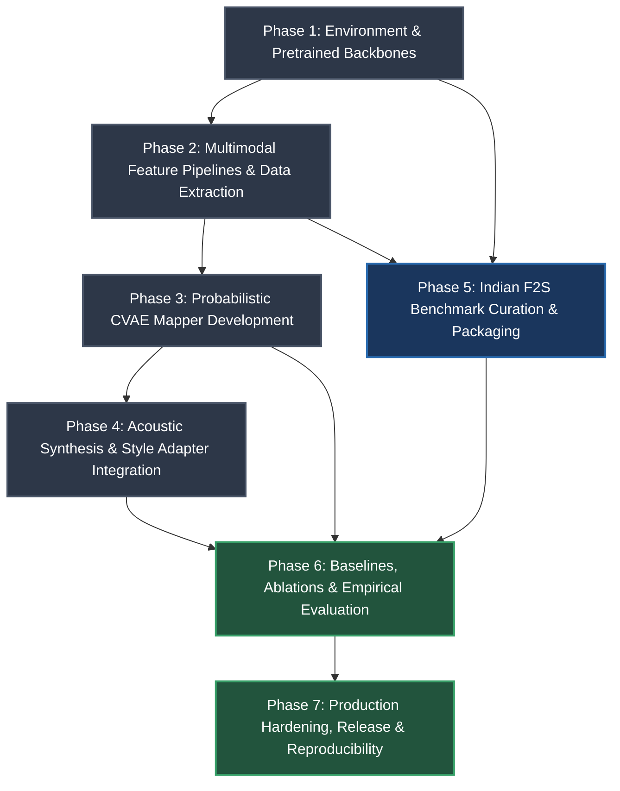

# Engineering Implementation Plan Overview

> **Project:** VOIX — Probabilistic Face-to-Voice Generation Through Cross-Modal Identity Modeling  
> **Repository:** `AdityaWagh19/Voix-F2S-System`  
> **Status:** Definitive Engineering Blueprint

---

## 1. Phase Breakdown Rationale

The implementation plan decomposes the VOIX research system into seven sequential, independently testable phases. The architectural principle governing this breakdown is **strict incremental verification**: each phase produces a functional, validated subsystem before subsequent modules introduce additional complexity.

```
Phase 1: Environment & Backbones      -> COMPLETE (commit 2802626, 35 tests passed), CUDA determinism, tests
Phase 2: Multimodal Feature Pipelines  -> Pre-extracted 100K paired representations (560-D face, 192-D voice)
Phase 3: Probabilistic CVAE Mapper     -> Calibrated P(e_s | e_f) distribution, anti-collapse loss
Phase 4: Acoustic Synthesis & Adapter  -> End-to-end waveform generation, AudioSeal watermarking
Phase 5: Indian Benchmark Curation     -> 20h multimodal dataset, SyncNet verification, IndicLID
Phase 6: Baselines, Ablations & Eval   -> B1-B6 baselines, A1-A6 & B1-B4 ablations, MOS, statistical tests
Phase 7: Hardening & Reproducibility   -> 3-seed validation, HuggingFace publication, inference CLI
```

### Key Risk Mitigations Built into Sequencing
1. **Backbone Isolation (Phase 1):** Pretrained weights (ArcFace, ECAPA, MediaPipe, StyleTTS 2) are verified on isolated test fixtures first, preventing upstream numerical bugs from polluting generative training.
2. **Offline Representation Decoupling (Phase 2):** Heavy feature extraction is decoupled from model training. The CVAE trains on static pre-extracted tensor caches ($560\text{-D} \to 192\text{-D}$), keeping GPU VRAM under 2 GB and iteration cycles under 15 minutes per epoch on an RTX 4050.
3. **Generative Space Validation Before Waveform Synthesis (Phase 3 before Phase 4):** Latent space calibration, KL divergence, and cosine similarity are validated in embedding space before introducing the frozen neural vocoder and style adapter.
4. **Independent Benchmark Pipeline (Phase 5):** The India F2S curation pipeline is developed after the core model pipeline is operational, allowing synthetic baseline evaluation on VoxCeleb1 while benchmark streaming data is processed.
5. **Systematic Experimental Execution (Phase 6):** Every baseline and ablation uses standardized evaluation harnesses, eliminating divergence between reported metrics.

---

## 2. Dependency Graph



---

## 3. Phase Mapping

| Phase | Specification Document | Primary Scope | Primary Deliverables | Target Timeline |
|---|---|---|---|---|
| **Phase 1** | [`phase-1-environment-and-pretrained-backbones.md`](phase-1-environment-and-pretrained-backbones.md) | Compute configuration, dependency isolation, pretrained backbone test suite | Environment manifest, test fixtures, scaffolding | Week 1 |
| **Phase 2** | [`phase-2-feature-extraction-and-data-pipelines.md`](phase-2-feature-extraction-and-data-pipelines.md) | Frontal frame selection, 32-D FaceMesh ratios, demographic priors, VoxCeleb2 extraction | 100K cached pairs, serialization pipelines | Weeks 2–3 |
| **Phase 3** | [`phase-3-probabilistic-cvae-mapper.md`](phase-3-probabilistic-cvae-mapper.md) | CVAE architecture, reparameterization, free-bits KL, cyclical beta annealing | Trained CVAE checkpoint, loss curves, clustering | Weeks 4–6 |
| **Phase 4** | [`phase-4-acoustic-synthesis-and-style-adapter.md`](phase-4-acoustic-synthesis-and-style-adapter.md) | StyleTTS 2 adapter MLP, SECS acoustic loss, AudioSeal watermarking, end-to-end inference | Working inference pipeline, watermarked audio | Weeks 7–8 |
| **Phase 5** | [`phase-5-indian-f2s-benchmark-curation.md`](phase-5-indian-f2s-benchmark-curation.md) | Non-persistent stream ingestion, SyncNet ASD, ArcFace purity, Whisper ASR, IndicLID | 20-hour verified benchmark, metadata manifest | Weeks 9–11 |
| **Phase 6** | [`phase-6-baselines-ablations-and-evaluation.md`](phase-6-baselines-ablations-and-evaluation.md) | Baselines B1–B6, ablations A1–A6 & B1–B4, zero-shot vs fine-tuning, SHAP, MOS study | Evaluation tables, ablation results, statistical tests | Weeks 12–14 |
| **Phase 7** | [`phase-7-production-hardening-and-reproducibility.md`](phase-7-production-hardening-and-reproducibility.md) | 3-seed reproducibility audit, HuggingFace Hub publishing, inference CLI, documentation | Turnkey CLI, HuggingFace release, camera-ready code | Weeks 15–16 |

---

## 4. Implementation Order & Critical Path

The project follows a strict critical path:

1. **Gate 0:** All pretrained models in Phase 1 pass deterministic unit tests with zero VRAM leaks.
2. **Gate 1:** Phase 2 data extraction achieves $>99.5\%$ verification purity across the 100K VoxCeleb2 training set.
3. **Gate 2:** Phase 3 CVAE shows no posterior collapse ($\text{KL} \ge 0.5$ nats/dim on active latents) and outperforms deterministic MLP reconstruction error.
4. **Gate 3:** Phase 4 end-to-end synthesis produces intelligible, watermarked speech from a single face image with $\text{SECS} > 0.65$ on target speakers.
5. **Gate 4:** Phase 5 Indian benchmark passes SyncNet AV offset validation ($>4.5$) and Whisper/IndicLID quality checks.
6. **Gate 5:** Phase 6 confirms statistically significant improvements in feature ablation ($A6 > A1$) and confirms demographic gap ($H3$).
7. **Gate 6:** Phase 7 confirms reproducibility variance ($\sigma < 0.015$) across seeds `42`, `43`, `44`.

---

## 5. Progress Tracking Guidelines

For each phase:
- **Pre-execution Checklist:** Verify all prerequisite phase artifacts exist and pass regression tests.
- **Git Commits:** Every task corresponds to an atomic commit referencing the phase task ID (e.g., `feat(phase-2): implement 32-D FaceMesh ratio extractor [T2.3]`).
- **Phase Completion Tagging:** When all acceptance criteria in a phase specification are met, create a Git tag (e.g., `git tag -a phase-1-complete -m "Phase 1 verified"`).
- **Status Reporting:** Update the master task checklist in [`project-context/tasks.md`](../project-context/tasks.md) marking items complete with execution dates.

---

## 6. Project Directory and File Index

The repository will be populated according to the following layout across the phases:

```
Voix-F2S-System/
+-- plans/                                # Engineering implementation plans
¦   +-- overview.md                       # This document
¦   +-- phase-1-environment-and-pretrained-backbones.md
¦   +-- phase-2-feature-extraction-and-data-pipelines.md
¦   +-- phase-3-probabilistic-cvae-mapper.md
¦   +-- phase-4-acoustic-synthesis-and-style-adapter.md
¦   +-- phase-5-indian-f2s-benchmark-curation.md
¦   +-- phase-6-baselines-ablations-and-evaluation.md
¦   +-- phase-7-production-hardening-and-reproducibility.md
+-- project-context/                      # Canonical design documentation
¦   +-- context.md
¦   +-- architecture.md
¦   +-- research.md
¦   +-- mvp.md
¦   +-- tasks.md
+-- configs/                              # Centralized configuration files (YAML)
¦   +-- environment.yaml
¦   +-- data_extraction.yaml
¦   +-- cvae_training.yaml
¦   +-- adapter_training.yaml
¦   +-- benchmark_curation.yaml
¦   +-- evaluation.yaml
+-- voix/                                 # Primary Python source package
¦   +-- __init__.py
¦   +-- data/                             # Dataset extraction & loading
¦   ¦   +-- __init__.py
¦   ¦   +-- face_extractor.py             # ArcFace, FaceMesh, demographics
¦   ¦   +-- speaker_extractor.py          # SpeechBrain ECAPA-TDNN
¦   ¦   +-- dataset.py                    # PyTorch Dataset for cached pairs
¦   ¦   +-- stream_curator.py             # yt-dlp, SyncNet, Whisper, IndicLID
¦   +-- models/                           # Neural network modules
¦   ¦   +-- __init__.py
¦   ¦   +-- fusion.py                     # 560-D Linear + LayerNorm + GELU
¦   ¦   +-- cvae.py                       # Probabilistic CVAE Encoder & Decoder
¦   ¦   +-- adapter.py                    # 3-layer MLP Style Adapter
¦   ¦   +-- watermarking.py               # AudioSeal integration wrapper
¦   +-- training/                         # Optimization pipelines
¦   ¦   +-- __init__.py
¦   ¦   +-- losses.py                     # L_recon, L_KL (free bits), L_style
¦   ¦   +-- trainer_cvae.py               # CVAE training loop with W&B
¦   ¦   +-- trainer_adapter.py            # StyleTTS2 adapter alignment loop
¦   +-- evaluation/                       # Metric computation suite
¦   ¦   +-- __init__.py
¦   ¦   +-- metrics.py                    # SECS, Recall@K, DS, ECE, FSD
¦   ¦   +-- baselines.py                  # B1 to B6 baseline implementations
¦   ¦   +-- ablations.py                  # Feature & architecture ablation harnesses
¦   ¦   +-- shap_analysis.py              # SHAP craniofacial feature attribution
¦   +-- inference/                        # End-to-end inference APIs
¦       +-- __init__.py
¦       +-- pipeline.py                   # Face + Text -> K Voice generation
+-- tests/                                # Automated verification test suite
¦   +-- test_backbones.py
¦   +-- test_features.py
¦   +-- test_cvae.py
¦   +-- test_adapter.py
¦   +-- test_end_to_end.py
+-- scripts/                              # Batch operational CLI scripts
¦   +-- extract_voxceleb.py
¦   +-- curate_indian_benchmark.py
¦   +-- run_training.py
¦   +-- run_evaluation.py
¦   +-- voix_cli.py
+-- README.md
+-- requirements.txt
+-- .gitignore
```

---

## 7. Overall System Deliverables

Upon completion of Phase 7, VOIX will deliver:

1. **A Trained CVAE Probabilistic Model:** Checkpoints capable of sampling $K$ plausible, diverse speaker embeddings conditioned on a 560-D fused face representation.
2. **A Trained Style Adapter:** Weight checkpoints mapping predicted ECAPA embeddings into StyleTTS 2 style space for high-fidelity 24 kHz waveform synthesis.
3. **An India-Specific Audio-Visual Benchmark:** A published dataset of 40–60 speakers across 5 regional languages, featuring 25% code-switching, released as embedding vectors and metadata manifests on HuggingFace Datasets.
4. **An Empirical Evaluation Suite:** Comprehensive metrics (SECS, Recall@K, Diversity Score, ECE, FSD, MOS) validating hypotheses H1, H2, and H3 against 6 baseline architectures.
5. **A Reproducible Research Codebase:** Fully documented code, 3-seed verification logs, and an open-source inference CLI.
